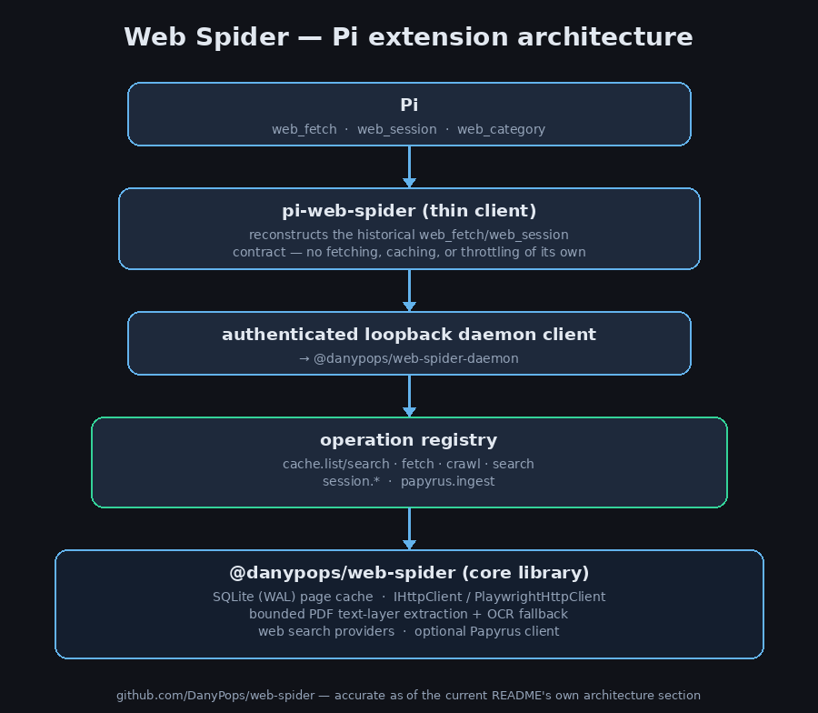

# @danypops/pi-web-spider

[](https://www.npmjs.com/package/@danypops/pi-web-spider)
[](https://github.com/DanyPops/web-spider/blob/main/LICENSE)

Web fetch, web search, and real browser sessions for [Pi](https://github.com/earendil-works/pi) — an agent-ready alternative to raw HTML scraping.

## Why Web Spider

- **Zero-config search** — works with no API key via a bounded keyless fallback (Firecrawl); configure any of 7 keyed providers (Brave, Brave LLM Context, Tavily, Exa, Serper, SerpApi, You.com) for higher limits, with automatic round-robin quota-spreading and fallback once you do.
- **Honest PDF extraction** — bounded text-layer extraction with an automatic OCR fallback for scanned or garbled pages. A page that genuinely can't be recovered reports `contentOk: false`, never a false-success claim.
- **Real structured extraction, not scraping** — GitHub (REST/GraphQL), MediaWiki (Wikipedia and any MediaWiki wiki), `llms.txt`, and `.md`-suffix docs (AWS-docs-style) are queried through their actual APIs.
- **A disk-backed page cache that survives restarts** — every fetch is cached to SQLite (WAL) and searchable by full text, domain, tag, curated category, or date range, at zero network cost on a hit.
- **Real interactive browser sessions** — `web_session` for pages a single fetch can't handle: type, click, select, wait on async results, read tables, screenshot, handle native dialogs, capture downloads.
- **A standalone resource finder, not just a summarizer** — `web_quotes` returns ranked, verbatim quotes per URL with a copy-pasteable citation link, never an LLM-digested answer.

```
pi install npm:@danypops/pi-web-spider
```

## Quick Start

```js
// Fetch a page as clean markdown
web_fetch({ url: "https://example.com/docs/getting-started" })

// Crawl one hop of same-domain links
web_fetch({ url: "https://example.com", depth: 1 })

// Search the web instead of fetching a URL
web_fetch({ searchQuery: "readability extraction library comparison" })

// Query everything already cached, no network call
web_fetch({ query: "readability extraction", domain: "github.com" })

// Open an interactive browser session for a page that needs real input
web_session({ operation: "create", name: "research" })

// Deep research: find sources, then pull exact quotes from them
web_fetch({ searchQuery: "precision time protocol clock synchronization" })
web_quotes({ query: "clock synchronization accuracy", urls: ["https://example.com/ptp-overview"] })
```

See [`docs/web-fetch-api.md`](https://github.com/DanyPops/web-spider/blob/main/docs/web-fetch-api.md) for the full parameter/output reference behind these examples.

## Tools

### `web_fetch`
Fetch a URL, crawl N hops deep, or search the web — one tool, three modes:

- **Fetch**: `url` → clean markdown, lean outline, link list, BM25F highlights, or a semantic tree. JSON/text is normalized, while PDFs get bounded text-layer extraction with `pdfPageStart`/`pdfPageEnd` (1-based, inclusive, maximum 50 pages). Empty/garbled pages get an automatic, bounded OCR fallback; a page it still can't recover reports `contentOk: false` honestly rather than implying success.
- **Crawl**: `url` + `depth` → BFS crawl same-domain links, `robots.txt`-respecting and per-domain throttled, with an explicit audited `ignoreRobots` opt-out for a human-directed one-off.
- **Search**: `searchQuery` instead of `url` → real ranked results instead of a guessed slug. Routes across whichever of Brave, Brave LLM Context, Tavily, Exa, Serper, SerpApi, and You.com you've configured, round-robining for quota spread and falling back automatically on a rate limit or empty result.
- **Cache query**: omit `url` entirely → full-text search or filter (domain, tag, curated category, date range) over every page already fetched, disk-backed, survives restarts, zero network cost.

Structured extraction beats generic scraping where a real API exists: GitHub (REST/GraphQL), MediaWiki (Wikipedia and any MediaWiki wiki), `llms.txt`, and `.md`-suffix docs (AWS-docs-style) are recognized and queried directly.

### `web_session`
Persistent, named browser sessions for pages that need real interaction, not a single fetch: type into search boxes, select dropdowns, wait on async results, read a table. Supports navigate/click/hover/type/select/waitFor, structured extraction (`queryText`/`readTable`), accessibility-tree snapshots, screenshots, native dialog handling, file downloads, tab management, and console/network capture.

### `web_category`
Your own curated relevance categories over cached pages (e.g. "Code", "PTP Protocol") — distinct from a page's domain or its publisher's own tags. A page can belong to more than one category; assign, remove, rename, or list.

### `web_quotes`
A standalone resource finder: given a query and an explicit list of URLs (typically a prior `web_fetch(searchQuery=...)` call's own results), fetches each one and returns ranked, verbatim BM25F quotes per URL as resource cards — never an LLM-digested summary. Every quote carries a `citationUrl`, a real URL Text Fragment (`#:~:text=...`) that scrolls to and highlights the exact quoted passage in any modern browser. `maxQuotesPerUrl`/`maxQuotesTotal` bound the per-source and combined result; a URL that fails to fetch becomes its own `{ url, error }` card instead of failing the whole batch.

## Architecture



A supervised daemon (`@danypops/web-spider-daemon`) owns the SQLite page cache and every network fetch, crawl, throttle, and robots.txt check. This extension is a thin authenticated client — it never touches the network or a cache file directly, and auto-starts the daemon transparently on first use.

```
pi web_fetch / web_session / web_category / web_quotes
      ↓
this extension (thin client)
      ↓
authenticated loopback daemon → web-spider-daemon
      ↓
SQLite (WAL) cache · fetch/PDF/crawl/search execution · optional Papyrus ingestion
```

## Configuring search

Search works without configuration through Firecrawl's bounded keyless fallback. For higher and more predictable limits, set a provider API key as an environment variable (`BRAVE_SEARCH_API_KEY`, `TAVILY_API_KEY`, `EXA_API_KEY`, `SERPER_API_KEY`, `SERPAPI_API_KEY`, `YOU_API_KEY`) or store it locally:

```bash
web-spider search-key set brave
```

Configured providers are tried before keyless Firecrawl; configuring more than one gets automatic round-robin quota spreading plus fallback — no code changes, just more keys.

## Running as a service

The daemon auto-starts on first tool call. For persistence across reboots/logins (and to forward search keys into a systemd `--user` unit, which does not inherit the installing shell's environment):

```bash
web-spider service install
```

## Learn more

- [`docs/web-fetch-api.md`](https://github.com/DanyPops/web-spider/blob/main/docs/web-fetch-api.md) — full `web_fetch` parameter/output reference
- [`docs/web-session-api.md`](https://github.com/DanyPops/web-spider/blob/main/docs/web-session-api.md) — full `web_session` reference
- [`packages/web-spider-daemon/README.md`](https://github.com/DanyPops/web-spider/blob/main/packages/web-spider-daemon/README.md) — daemon architecture, CLI reference, service install

## Security

This extension executes with full system access, like any Pi extension. Review the source before installing.
